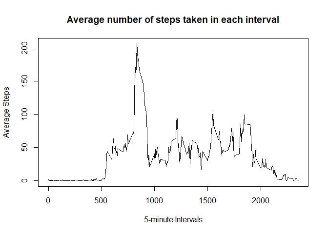
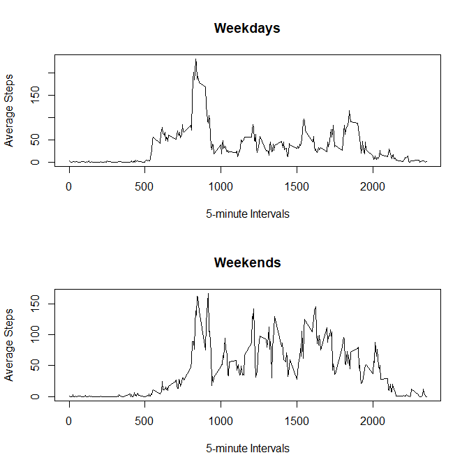

## Loading and preprocessing the data


```r
activity_data <- read.csv("./activity/activity.csv")
```


## What is mean total number of steps taken per day?


```r
# Calculating the total number of steps per day 
 steps_total <- tapply(activity_data$steps, activity_data$date, FUN = sum, na.rm = T)
# Creating a histogram of total number of steps taken per day
hist(steps_total, main = "Histogram of total number of steps taken per day", xlab = "total number of steps per day")
```

<!-- -->

```r
# Mean of total number of steps taken per day
mean(steps_total)
```

```
## [1] 9354.23
```

```r
# Median of total number of steps taken per day
median(steps_total)
```

```
## [1] 10395
```


## What is the average daily activity pattern?


```r
# Calculating the average number of steps for each 5 minute interval (averaged across all days)
avg_steps <- aggregate(steps ~ interval, data = activity_data, mean, na.rm = T)
# Creating a time series plot 
 plot(avg_steps$interval, avg_steps$steps, type = "l", xlab = "5-minute Intervals", ylab = "Average Steps", main = "Average number of steps taken in each interval")
```

<!-- -->

```r
 # 5-minute interval with maximum number of steps 
 avg_steps$interval[which.max(avg_steps$steps)]
```

```
## [1] 835
```

## Inputing missing values


```r
# Calculating total number of missing values in the dataset 
sum(is.na(activity_data))
```

```
## [1] 2304
```
#### Strategy used: Substitute missing steps with the mean steps value for that particular 5 minute interval 

```r
activity_data_new <- activity_data
# Function to input the missing value 
missing_values <- function(var1, var2){
  if(is.na(var1)){
    return (avg_steps$steps[avg_steps$interval == var2])
  }
  else
    return (var1)
}
#Applying function to the new dataset
missing_steps <- mapply(missing_values, activity_data$steps, activity_data$interval)
activity_data_new$steps <- unlist(missing_steps)
# Calculating the total number of steps per day 
 steps_total_new <- tapply(activity_data_new$steps, activity_data_new$date, FUN = sum, na.rm = T)
# Creating a histogram of total number of steps taken per day
hist(steps_total_new, main = "Histogram of total number of steps taken per day", xlab = "total number of steps per day")
```

<!-- -->

```r
# Mean of total number of steps taken per day after inputting missing values
mean(steps_total_new)
```

```
## [1] 10766.19
```

```r
# Median of total number of steps taken per day after inputting missing values
median(steps_total_new)
```

```
## [1] 10766.19
```
#### The mean and median steps calculated after inputting missing values differ from the ones calculate by ignoring the missing values. A comparison of the histograms for total number of steps taken per day before and after inputting missing values shows an increase in the frequency for each of the intervals. 

## Are there differences in activity patterns between weekdays and weekends?

```r
#Creating a new column with two factor variables - weekday, weekend
activity_data_new$weekday <- weekdays(as.Date(activity_data_new$date))
weekday_factor <- factor(activity_data_new$weekday)
#Change factor level from Mon,Tues, Wed etc to "weekday" or "weekend"
levels(weekday_factor) <- c("weekday", "weekday", "weekend", "weekend", "weekday", "weekday", "weekday")
activity_data_new$weekday <- weekday_factor
# Calculating the average number of steps for each 5 minute interval (averaged across weekdays and weekends)
avg_steps_weekday <- aggregate(steps ~ interval + weekday, data = activity_data_new, mean, na.rm = T)
# Split the data frame according to weekday and weekend factors
avg_steps_split <- split(avg_steps_weekday, avg_steps_weekday$weekday)
# Creating a time series plot 
par(mfrow = c(2,1))
plot(avg_steps_split$weekday$interval, avg_steps_split$weekday$steps, type = "l", xlab = "5-minute Intervals", ylab = "Average Steps", main = "Weekdays") 
plot(avg_steps_split$weekend$interval, avg_steps_split$weekend$steps, type = "l", xlab = "5-minute Intervals", ylab = "Average Steps", main = "Weekends")
```

<!-- -->
